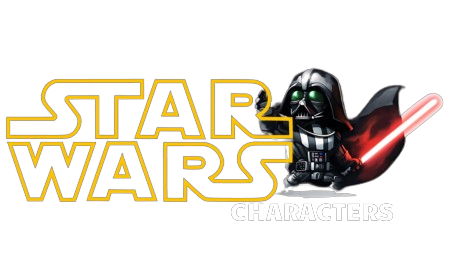

<h1 align="center">
    
    <p>May the force be with you!🦾<p/>
</h1>


## Índice
[Sobre](#🚨-sobre)&nbsp;|
[Ferramentas](#🔨-ferramentas)&nbsp;|
[Como Conntribuir](#💻-como-contribuir)&nbsp;|
[Licença](#📋-licença)&nbsp;|

## 🚨 Sobre
O projeto traz consigo diversas informações dos personagens da franquia Star Wars, onde é possível navegar entre páginas que, ao clicar em um personagem, se abre um modal com suas respectivas características. Essas informações por sua vez estão sendo obtidas da API [Swapi](https://swapi.dev/). O intuito desse projeto foi de colocar em prática os meus estudos em JavaScript, consumindo a API e manipulando elementos através de JS.
## 🔨 Ferramentas
- HTML
- CSS
- JavaScript

## 💻 Como Contribuir

```bash
    # Clone o projeto
    $ git clone  https://github.com/lucasnp92/star-wars-characters.git
````

```bash
    # Entre no diretório
    $ cd star-wars-character
```

```bash
    # Instale as dependencias, se você usa npm
    $ npm install
```
<p align="center">ou</p>

```bash
    # Instale as dependencias, se você usa yarn
    $ yarn
```

## 📋 Licença
Este projeto está sob licença MIT. Veja o arquivo [LICENSE](https://github.com/lucasnp92/star-wars-characters/blob/master/LICENSE) para mais detalhes.